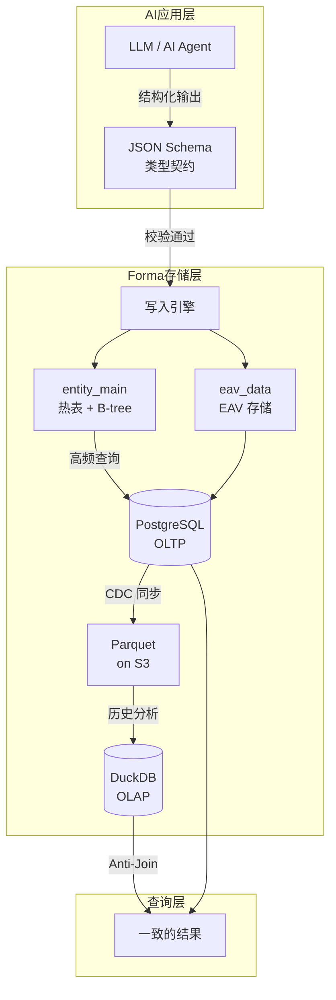

# Forma 工程博客系列：从 EAV 到零脏读的 Lakehouse

> 三篇文章，讲透一个为 AI 时代设计的灵活数据存储引擎

---

## 这个系列讲什么？

当你的 AI 应用每天产出几十种新的数据结构，而数据库还在等 DBA 审批 `ALTER TABLE`——这中间的鸿沟，就是 Forma 要解决的问题。

这个系列记录了我们在构建 Forma 过程中的工程实践：如何让数据库既能适应 AI 时代的快速迭代，又不牺牲查询性能和数据一致性。

---

## Forma 是什么

**Forma** 是一个为 AI 时代设计的灵活数据存储引擎。它基于三个核心技术选型：

| 技术 | 作用 | 解决的问题 |
|------|------|-----------|
| **EAV 模式** | 属性存储为行，新增字段无需 DDL | Schema 灵活性 |
| **JSON Schema** | AI 原生的数据契约，写入即校验 | 类型安全 + AI 集成 |
| **PostgreSQL + DuckDB** | OLTP 与 OLAP 协同，冷热分离 | 性能 + 成本平衡 |

---

## 我们要解决的三个问题

### 问题一：AI 数据结构的快速迭代

AI Agent 今天输出 12 个字段，明天输出 30 个字段，下周又加了 5 个新字段。传统数据库的 DDL 流程（提工单 → 审批 → 停服 → ALTER TABLE）根本跟不上这个节奏。

**→ 第一篇文章**解释为什么 JSON Schema + EAV + 热表的组合是 AI 应用的最佳落地姿势：零 DDL、即时生效、类型安全。

### 问题二：N+1 查询的性能噩梦

EAV 模式很灵活——新增字段只需插入行，不用改表结构。但它的查询性能是出了名的差：查询 100 条记录可能需要 101 次数据库往返，延迟轻松破秒。

**→ 第二篇文章**展示如何用 PostgreSQL 的 CTE + JSON_AGG 将查询次数从 101 降到 1，延迟从 1000ms 降到 25ms。

### 问题三：海量历史数据的一致性

当数据量达到亿级，冷热分离是必然选择。但"Lakehouse"听起来很美好，每个工程师心里都有一个疑问：**我怎么知道查出来的数据不是脏的？**

**→ 第三篇文章**详细解释 Forma 如何用 Anti-Join + Dirty Set 机制，确保联邦查询永远不会读到未提交或不一致的数据。

---

## 阅读指南：根据你的场景选择

| 你的场景 | 推荐从这里开始 |
|---------|---------------|
| 正在构建 AI 应用，需要灵活的数据存储 | [第一篇：AI 架构篇](./01-ai-ready-cn.md) |
| 被 N+1 查询困扰，想快速提升性能 | [第二篇：杀死 N+1](./02-performance-cn.md) |
| 数据量增长，考虑冷热分离架构 | [第三篇：Serverless 湖仓](./03-lakehouse-cn.md) |
| 想全面了解 Forma 架构 | 按顺序阅读全部三篇 |

---

## 系列文章

### [第一篇] 为什么 EAV 是 AI 时代最被低估的数据模型

**TL;DR**：JSON Schema 不只是校验工具——它是 AI-Ready 基础设施的核心。配合热表设计，实现"AI 输出 → 即时校验 → 零 DDL 入库"。

→ [阅读中文版](./01-ai-ready-cn.md) | [Read in English](./01-ai-ready-en.md)

---

### [第二篇] 杀死 N+1：一次 SQL 优化如何让延迟从 1 秒降到 25 毫秒

**TL;DR**：用 PostgreSQL CTE + JSON_AGG，将数据库往返从 101 次减少到 1 次，延迟下降 97%。

→ [阅读中文版](./02-performance-cn.md) | [Read in English](./02-performance-en.md)

---

### [第三篇] 零脏读的 Serverless 湖仓：我们如何用 DuckDB 解决一致性难题

**TL;DR**：PostgreSQL 负责"当下"，DuckDB + Parquet 负责"历史"。Anti-Join + Dirty Set 机制确保联邦查询零脏读。

→ [阅读中文版](./03-lakehouse-cn.md) | [Read in English](./03-lakehouse-en.md)

---

## 关于 Forma

Forma 是一个开源项目，致力于为 AI 时代提供灵活、高性能、低成本的数据存储解决方案。

- **GitHub**：[github.com/ruoshui/forma](https://github.com/ruoshui/forma)
- **文档**：[forma.dev/docs](https://forma.dev/docs)

如果这个系列对你有帮助，欢迎 Star 我们的项目，或者加入社区讨论！
