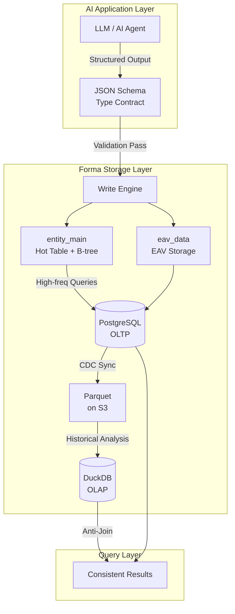

# Forma Engineering Blog Series: From EAV to Zero-Dirty-Read Lakehouse

> Three posts that explain a flexible data storage engine designed for the AI era

---

## What's This Series About?

When your AI application produces dozens of new data structures every day, while your database is still waiting for DBA approval on `ALTER TABLE`—that gap is exactly what Forma is built to solve.

This series documents our engineering practices while building Forma: how to make databases adapt to the rapid iteration of the AI era without sacrificing query performance or data consistency.

---

## What is Forma?

**Forma** is a flexible data storage engine designed for the AI era. It's built on three core technology choices:

| Technology | Purpose | Problem Solved |
|------------|---------|----------------|
| **EAV Pattern** | Attributes stored as rows, no DDL for new fields | Schema flexibility |
| **JSON Schema** | AI-native data contracts, validation on write | Type safety + AI integration |
| **PostgreSQL + DuckDB** | OLTP and OLAP working together, hot/cold separation | Performance + cost balance |

---

## Three Problems We're Solving

### Problem One: Rapid AI Data Structure Iteration

Your AI Agent outputs 12 fields today, 30 fields tomorrow, and adds 5 new fields next week. Traditional database DDL workflows (file ticket → approval → downtime → ALTER TABLE) simply can't keep up with this pace.

**→ Post One** explains why the combination of JSON Schema + EAV + Hot Table is the ideal architecture for AI applications: zero DDL, instant effect, type-safe.

### Problem Two: The N+1 Query Performance Nightmare

The EAV pattern is flexible—adding new fields just means inserting rows, no schema changes. But its query performance is notoriously bad: fetching 100 records might require 101 database round-trips, easily pushing latency past one second.

**→ Post Two** shows how to use PostgreSQL's CTE + JSON_AGG to reduce queries from 101 to 1, cutting latency from 1000ms to 25ms.

### Problem Three: Consistency with Massive Historical Data

When data reaches billions of records, hot/cold separation becomes inevitable. But while "Lakehouse" sounds great, every engineer has the same nagging question: **How do I know the data I'm querying isn't dirty?**

**→ Post Three** explains in detail how Forma uses Anti-Join + Dirty Set mechanisms to ensure federated queries never read uncommitted or inconsistent data.

---

## Reading Guide: Choose Based on Your Scenario

| Your Scenario | Start Here |
|---------------|------------|
| Building AI applications, need flexible data storage | [Post 1: AI Architecture](./01-ai-ready-en.md) |
| Struggling with N+1 queries, want quick performance gains | [Post 2: Killing N+1](./02-performance-en.md) |
| Data growing, considering hot/cold separation | [Post 3: Serverless Lakehouse](./03-lakehouse-en.md) |
| Want comprehensive understanding of Forma architecture | Read all three in order |

---

## The Series

### [Post 1] Why EAV is the Most Underrated Data Model for AI

**TL;DR**: JSON Schema isn't just a validation tool—it's the core of AI-Ready infrastructure. Combined with hot table design, achieve "AI output → instant validation → zero-DDL storage."

→ [Read in English](./01-ai-ready-en.md) | [阅读中文版](./01-ai-ready-cn.md)

---

### [Post 2] Killing N+1: How One SQL Trick Cut Our Latency by 40x

**TL;DR**: Using PostgreSQL CTE + JSON_AGG, we reduced database round-trips from 101 to 1, cutting latency by 97%.

→ [Read in English](./02-performance-en.md) | [阅读中文版](./02-performance-cn.md)

---

### [Post 3] Zero Dirty Reads: Building a Trustworthy Lakehouse with DuckDB

**TL;DR**: PostgreSQL handles "the present," DuckDB + Parquet handles "the past." Anti-Join + Dirty Set mechanisms ensure zero dirty reads in federated queries.

→ [Read in English](./03-lakehouse-en.md) | [阅读中文版](./03-lakehouse-cn.md)

---

## About Forma

Forma is an open-source project dedicated to providing flexible, high-performance, and cost-effective data storage solutions for the AI era.

- **GitHub**: [github.com/ruoshui/forma](https://github.com/ruoshui/forma)
- **Documentation**: [forma.dev/docs](https://forma.dev/docs)

If this series has been helpful, please consider starring our project on GitHub or joining the community discussion!
