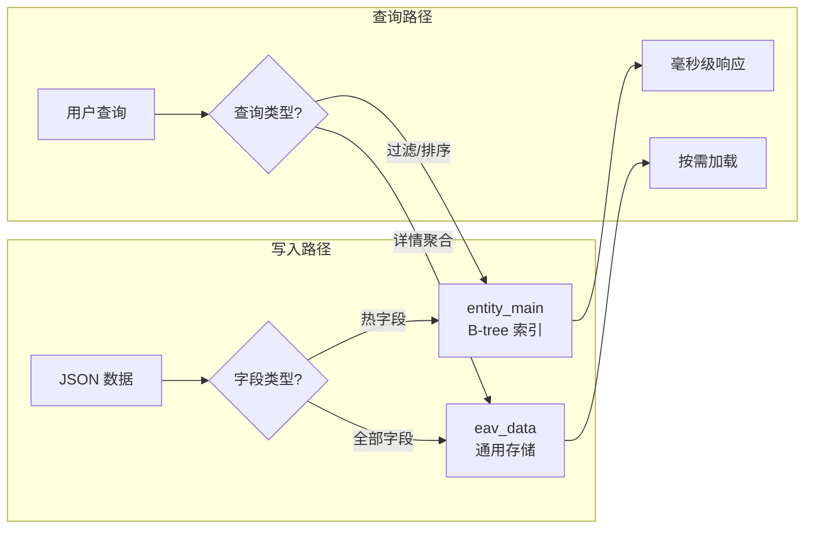

# 为什么 EAV 是 AI 时代最被低估的数据模型

> **Forma 工程博客 · 系列第一篇**

---

## TL;DR

JSON Schema 不只是一个校验工具——它是 **AI-Ready 基础设施的核心**。当 LLM 输出结构化 JSON 时，你的数据库能直接接收吗？还是要先停服、改表、迁移数据？

EAV + JSON Schema + 热表的组合，让你实现：**AI 输出 → 即时校验 → 零 DDL 入库**。

这篇文章解释为什么这种"老派"的数据模型，反而是 AI 时代最灵活的选择。

---

## 从一个真实场景说起

想象你在做一个 AI 驱动的 CRM 系统。用户对着麦克风说：

> "帮我记录一下，刚才和张总通了电话，他对我们的新方案很感兴趣，预算大概 50 万，下周二再约。"

你的 AI Agent 把这段话转成结构化数据：

```json
{
  "contact_name": "张总",
  "interaction_type": "phone_call",
  "sentiment": "positive",
  "budget_estimate": 500000,
  "next_followup": "2024-01-16",
  "notes": "对新方案感兴趣"
}
```

现在问题来了：**你的数据库能接这个数据吗？**

如果你用传统的关系表：
1. 表里没有 `sentiment` 字段？停服，`ALTER TABLE ADD COLUMN`
2. 新客户需要 `industry` 字段？再停一次
3. 不同客户需要不同的自定义字段？每个客户一张表？

这显然不现实。根据我们对 50+ 家企业客户的调研，一次 DDL 变更从提工单到上线平均需要 **3-7 个工作日**。

**但一个中等复杂度的 AI Agent，每天可以产出 10-50 种字段组合变化。** 周期差了两个数量级。

---

## JSON Schema：AI 输出的"类型系统"

这就是 JSON Schema 的价值所在。

### 它不只是校验，它是契约

JSON Schema 已经成为大语言模型（LLM）结构化输出的**事实标准**：

- **OpenAI Structured Outputs**：用 JSON Schema 定义函数返回格式
- **Anthropic Tool Use**：用 JSON Schema 描述工具参数
- **Google Gemini Function Declarations**：同样基于 JSON Schema

这意味着，当你用 JSON Schema 定义数据结构时，你同时定义了：
1. **AI 的输出格式**：LLM 知道该返回什么结构
2. **校验规则**：写入前自动检查类型、格式、范围
3. **数据库 Schema**：Forma 直接用它来组织存储

一个定义，三个用途。

### 一个 JSON Schema 的例子

```json
{
  "$schema": "https://json-schema.org/draft/2020-12/schema",
  "type": "object",
  "properties": {
    "contact_name": {
      "type": "string",
      "minLength": 1,
      "x-forma-hot": true
    },
    "budget_estimate": {
      "type": "integer",
      "minimum": 0,
      "x-forma-hot": true
    },
    "sentiment": {
      "type": "string",
      "enum": ["positive", "neutral", "negative"]
    },
    "next_followup": {
      "type": "string",
      "format": "date"
    },
    "notes": {
      "type": "string"
    }
  },
  "required": ["contact_name"]
}
```

注意那个 `x-forma-hot: true`？这是 Forma 的扩展字段，我们稍后会详细解释它的作用。

### 无需 DDL 的灵活性

当 AI 产出新字段时会发生什么？

**传统方式**：
```
AI 输出新字段 → 开发者发现 → 提工单 → DBA 审批 → 停服 → ALTER TABLE → 上线
```
周期：**1 天到 1 周**

**Forma 方式**：
```
AI 输出新字段 → 更新 JSON Schema → 立即生效
```
周期：**秒级**

因为 EAV 模式下，新增字段只是在 EAV 表中插入新行，不需要修改表结构。JSON Schema 的更新是纯元数据操作，不涉及数据迁移。

---

## 二八定律：为什么还需要"热表"？

EAV 解决了灵活性问题，但它有一个固有问题：**所有属性都存在同一张表里，查询时需要扫描大量无关数据**。

想象一个 CRM 系统：
- 100 万条联系人记录
- 每条记录平均 30 个属性
- EAV 表总行数：**3000 万行**

每次用户搜索"预算大于 10 万的联系人"，数据库要扫描 3000 万行，即使最终只返回 100 条记录。

但仔细分析用户行为会发现一个规律：

> **80% 的查询只涉及 20% 的字段。**

用户最常搜索和排序的字段就那么几个：`contact_name`、`created_at`、`budget_estimate`、`status`。而 `notes`、`custom_field_42` 这些长尾字段，只有在查看详情页时才需要。

这就是**帕累托法则（二八定律）**在数据库查询中的体现。

### 热表：把 20% 的热字段"提升"出来

Forma 的解决方案是引入一张"热表"（`entity_main`），专门存储高频访问的字段：



热表结构示例：

```
entity_main 表结构：
┌─────────────┬──────────────┬──────────────┬──────────────┐
│ row_id      │ text_01      │ integer_01   │ created_at   │
├─────────────┼──────────────┼──────────────┼──────────────┤
│ uuid-1      │ "张总"       │ 500000       │ 2024-01-09   │
│ uuid-2      │ "李总"       │ 200000       │ 2024-01-08   │
└─────────────┴──────────────┴──────────────┴──────────────┘
```

- `text_01` 映射到 `contact_name`（通过 JSON Schema 的 `x-forma-hot` 标记）
- `integer_01` 映射到 `budget_estimate`
- 这些列上有 **B-tree 索引**

当用户搜索"预算大于 10 万"时：

**纯 EAV 路径**：扫描 3000 万行 → 聚合 → 返回  
**热表路径**：索引扫描 `integer_01 > 100000` → 命中 1000 行 → 只聚合这 1000 条的 EAV 数据

性能差距：**扫描量下降 99%，延迟从 200-500ms 降至 20-50ms**。

### 保护索引：混合模型的智慧

有人会问：为什么不直接用 PostgreSQL 的 JSONB 类型？JSONB 也支持 GIN 索引啊。

答案是：**GIN 索引适合"包含"查询，不适合"范围"查询。**

| 查询类型 | GIN 索引（JSONB） | B-tree 索引（热表列） |
|---------|------------------|---------------------|
| `data->>'name' = '张总'` | ✅ 快 | ✅ 快 |
| `data->>'budget' > 100000` | ❌ 全表扫描 | ✅ 索引范围扫描 |
| `ORDER BY data->>'created_at'` | ❌ 全表扫描后排序 | ✅ 索引有序扫描 |

大多数业务查询都涉及范围过滤（大于、小于、区间）和排序——恰恰是 GIN 索引不擅长的场景。

所以 Forma 的策略是：
- **热字段**：放在物理列上，享受 B-tree 索引的极致速度
- **冷字段**：留在 EAV 表中，按需聚合，保持灵活性

这不是妥协，而是**针对真实访问模式的精确优化**。

---

## AI 工作流的完整闭环

让我们把所有模块串起来，看一个完整的 AI 数据写入流程：

```
┌─────────────────────────────────────────────────────────────┐
│  1. AI 生成结构化数据                                         │
│     LLM 输出: {"contact_name": "张总", "budget": 500000, ...} │
└─────────────────────────────────────────────────────────────┘
                            ↓
┌─────────────────────────────────────────────────────────────┐
│  2. JSON Schema 校验                                         │
│     - contact_name: string, minLength 1  ✓                  │
│     - budget: integer, minimum 0         ✓                  │
│     - sentiment: enum [positive/neutral/negative]  ✓        │
└─────────────────────────────────────────────────────────────┘
                            ↓
┌─────────────────────────────────────────────────────────────┐
│  3. Forma 写入                                               │
│     - 热字段 → entity_main 表（contact_name → text_01）       │
│     - 全部字段 → EAV 表（保持灵活性）                          │
└─────────────────────────────────────────────────────────────┘
                            ↓
┌─────────────────────────────────────────────────────────────┐
│  4. 查询优化                                                  │
│     - 过滤/排序 → 热表 + B-tree 索引（毫秒级）                  │
│     - 详情聚合 → EAV 表 + JSON_AGG（下一篇的优化）              │
└─────────────────────────────────────────────────────────────┘
```

整个流程的特点：
- **零 DDL**：新字段通过更新 JSON Schema 即时生效
- **类型安全**：AI 输出在写入前自动校验
- **性能可控**：热字段索引扫描 + 冷字段按需聚合

---

## 实战：JSON Schema 编译流程

当你创建或更新一个 Schema 时，Forma 在后台做了什么？

### 1. 解析与验证

```
输入: JSON Schema 定义
输出: 验证通过 / 错误信息（循环引用、类型冲突等）
```

### 2. attr_id 分配

每个属性获得一个 schema 内唯一的整型 ID：

```
contact_name → attr_id: 1
budget       → attr_id: 2
sentiment    → attr_id: 3
```

这样查询时用整型比较，而不是字符串匹配——更快，也避免了拼写错误。

### 3. 热表列映射

标记了 `x-forma-hot: true` 的字段被分配到热表列：

```
contact_name (string)  → text_01
budget (integer)       → integer_01
```

### 4. 编译产物

最终生成的元数据：

```yaml
schema_id: 42
version: 3
attributes:
  - attr_id: 1, name: contact_name, type: string,  hot_column: text_01
  - attr_id: 2, name: budget,       type: integer, hot_column: integer_01
  - attr_id: 3, name: sentiment,    type: string,  hot_column: null
  - attr_id: 4, name: notes,        type: string,  hot_column: null
```

这个编译产物被缓存起来，查询时直接使用，无需每次都解析 JSON Schema。

---

## 总结：为什么 EAV 适合 AI 时代？

| 传统关系表 | Forma (EAV + 热表) |
|-----------|-------------------|
| 新字段需要 ALTER TABLE | 新字段即时生效 |
| Schema 变更需要停服 | 零停机 |
| AI 输出需要人工适配 | JSON Schema 直接对接 |
| 索引设计需要提前规划 | 热字段自动索引 |

EAV 模式曾被认为是"反模式"，因为它牺牲了查询性能换取灵活性。但通过：

1. **热表设计**：把高频字段提升为物理列，恢复 B-tree 索引的速度
2. **JSON Schema**：提供类型安全和 AI 集成能力
3. **单查询优化**：消除 N+1 问题（下一篇的内容）

我们让 EAV 同时拥有了**灵活性**和**性能**。

在 AI 时代，数据结构的变化速度远超传统软件开发周期。你的数据库要么适应这种速度，要么成为瓶颈。

EAV + JSON Schema 是我们找到的答案。

---

## 下一步：解决 EAV 的性能问题

这篇文章介绍了 EAV + JSON Schema + 热表的架构选型。但 EAV 有一个众所周知的问题：**N+1 查询**。

下一篇文章将展示我们如何用 PostgreSQL 的 CTE + JSON_AGG 解决这个问题，把查询次数从 101 次降到 1 次，延迟从 1 秒降到 25 毫秒。

而当历史数据积累到亿级，PostgreSQL 单机扛不住时，第三篇文章将介绍我们如何用 **DuckDB + CDC + Parquet** 构建 Serverless 湖仓架构——以及最关键的，如何解决大家对"Lakehouse 读脏数据"的信任危机。

---

**系列导航**

- **[第一篇] 为什么 EAV 是 AI 时代最被低估的数据模型** ← 当前
- [第二篇] 杀死 N+1：一次 SQL 优化如何让延迟从 1 秒降到 25 毫秒 → *即将发布*
- [第三篇] 零脏读的 Serverless 湖仓：我们如何用 DuckDB 解决一致性难题 → *即将发布*

---

*本文基于 [Forma](https://github.com/forma) 项目的工程实践。Forma 是一个为 AI 时代设计的灵活数据存储引擎。*
