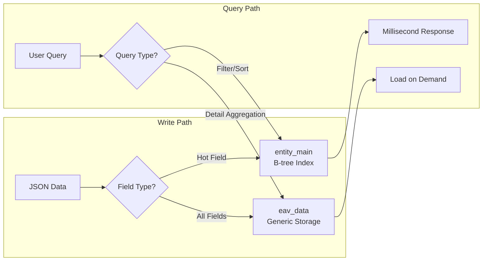

# Why EAV is the Most Underrated Data Model for AI

> **Forma Engineering Blog · Series Part 1**

---

## TL;DR

JSON Schema isn't just a validation tool—it's the **core of AI-Ready infrastructure**. When an LLM outputs structured JSON, can your database accept it directly? Or do you need to stop the service, alter the table, and migrate data first?

The combination of EAV + JSON Schema + Hot Table lets you achieve: **AI output → instant validation → zero-DDL storage**.

This post explains why this "old-school" data model is actually the most flexible choice for the AI era.

---

## Starting with a Real Scenario

Imagine you're building an AI-powered CRM system. A user speaks into their microphone:

> "Log this—I just had a call with Mr. Zhang. He's very interested in our new proposal, budget around $500K, let's follow up next Tuesday."

Your AI Agent transforms this into structured data:

```json
{
  "contact_name": "Mr. Zhang",
  "interaction_type": "phone_call",
  "sentiment": "positive",
  "budget_estimate": 500000,
  "next_followup": "2024-01-16",
  "notes": "Interested in new proposal"
}
```

Now here's the problem: **Can your database accept this data?**

If you're using traditional relational tables:
1. No `sentiment` column? Stop the service, `ALTER TABLE ADD COLUMN`
2. New customer needs an `industry` field? Stop again
3. Different customers need different custom fields? One table per customer?

This clearly doesn't scale. Based on our surveys of 50+ enterprise customers, a single DDL change takes an average of **3-7 business days** from ticket to deployment.

**But a moderately complex AI Agent can produce 10-50 field combination variations per day.** That's a two-order-of-magnitude mismatch in cycle time.

---

## JSON Schema: The "Type System" for AI Output

This is where JSON Schema's value shines.

### It's Not Just Validation—It's a Contract

JSON Schema has become the **de facto standard** for structured output from Large Language Models (LLMs):

- **OpenAI Structured Outputs**: Uses JSON Schema to define function return formats
- **Anthropic Tool Use**: Uses JSON Schema to describe tool parameters
- **Google Gemini Function Declarations**: Also based on JSON Schema

This means when you define a data structure with JSON Schema, you're simultaneously defining:
1. **AI output format**: The LLM knows what structure to return
2. **Validation rules**: Automatic type, format, and range checking before writes
3. **Database schema**: Forma uses it directly to organize storage

One definition, three purposes.

### A JSON Schema Example

```json
{
  "$schema": "https://json-schema.org/draft/2020-12/schema",
  "type": "object",
  "properties": {
    "contact_name": {
      "type": "string",
      "minLength": 1,
      "x-forma-hot": true
    },
    "budget_estimate": {
      "type": "integer",
      "minimum": 0,
      "x-forma-hot": true
    },
    "sentiment": {
      "type": "string",
      "enum": ["positive", "neutral", "negative"]
    },
    "next_followup": {
      "type": "string",
      "format": "date"
    },
    "notes": {
      "type": "string"
    }
  },
  "required": ["contact_name"]
}
```

Notice that `x-forma-hot: true`? That's a Forma extension field—we'll explain its purpose shortly.

### Flexibility Without DDL

What happens when AI produces a new field?

**Traditional approach**:
```
AI outputs new field → Developer notices → Files ticket → DBA approves → Stop service → ALTER TABLE → Deploy
```
Timeline: **1 day to 1 week**

**Forma approach**:
```
AI outputs new field → Update JSON Schema → Immediately effective
```
Timeline: **Seconds**

Because in the EAV pattern, adding a new field just means inserting new rows in the EAV table—no table structure changes needed. JSON Schema updates are pure metadata operations with no data migration.

---

## The Pareto Principle: Why We Still Need a "Hot Table"

EAV solves the flexibility problem, but it has an inherent problem: **All attributes live in the same table, requiring scans through massive amounts of irrelevant data on every query.**

Imagine a CRM system:
- 1 million contact records
- 30 attributes per record on average
- EAV table total rows: **30 million**

Every time a user searches for "contacts with budget over $100K," the database scans 30 million rows, even if only 100 records match.

But careful analysis of user behavior reveals a pattern:

> **80% of queries involve only 20% of fields.**

The fields users search and sort by most often are always the same few: `contact_name`, `created_at`, `budget_estimate`, `status`. Fields like `notes` or `custom_field_42` are only needed when viewing detail pages.

This is the **Pareto Principle (80/20 rule)** manifesting in database queries.

### Hot Table: "Promoting" the Top 20% of Fields

Forma's solution is to introduce a "hot table" (`entity_main`) dedicated to storing frequently-accessed fields:



Hot table structure example:

```
entity_main table structure:
┌─────────────┬──────────────┬──────────────┬──────────────┐
│ row_id      │ text_01      │ integer_01   │ created_at   │
├─────────────┼──────────────┼──────────────┼──────────────┤
│ uuid-1      │ "Mr. Zhang"  │ 500000       │ 2024-01-09   │
│ uuid-2      │ "Mr. Li"     │ 200000       │ 2024-01-08   │
└─────────────┴──────────────┴──────────────┴──────────────┘
```

- `text_01` maps to `contact_name` (via JSON Schema's `x-forma-hot` marker)
- `integer_01` maps to `budget_estimate`
- These columns have **B-tree indexes**

When a user searches for "budget over $100K":

**Pure EAV path**: Scan 30 million rows → aggregate → return  
**Hot table path**: Index scan `integer_01 > 100000` → hit 1,000 rows → aggregate only those 1,000 records' EAV data

Performance difference: **99% reduction in scan volume, latency drops from 200-500ms to 20-50ms**.

### Protecting the Index: The Wisdom of the Hybrid Model

Some might ask: Why not just use PostgreSQL's JSONB type? JSONB supports GIN indexes too.

The answer: **GIN indexes are good for "contains" queries, not "range" queries.**

| Query Type | GIN Index (JSONB) | B-tree Index (Hot Table Column) |
|------------|-------------------|--------------------------------|
| `data->>'name' = 'Zhang'` | ✅ Fast | ✅ Fast |
| `data->>'budget' > 100000` | ❌ Full table scan | ✅ Index range scan |
| `ORDER BY data->>'created_at'` | ❌ Full scan then sort | ✅ Index ordered scan |

Most business queries involve range filtering (greater than, less than, between) and sorting—exactly the scenarios where GIN indexes struggle.

So Forma's strategy is:
- **Hot fields**: Store in physical columns, enjoy the blazing speed of B-tree indexes
- **Cold fields**: Keep in EAV table, aggregate on demand, maintain flexibility

This isn't a compromise—it's **precise optimization for real access patterns**.

---

## The Complete AI Workflow Loop

Let's connect all the modules and trace a complete AI data write flow:

```
┌─────────────────────────────────────────────────────────────┐
│  1. AI generates structured data                             │
│     LLM output: {"contact_name": "Zhang", "budget": 500000}  │
└─────────────────────────────────────────────────────────────┘
                            ↓
┌─────────────────────────────────────────────────────────────┐
│  2. JSON Schema validation                                   │
│     - contact_name: string, minLength 1  ✓                   │
│     - budget: integer, minimum 0         ✓                   │
│     - sentiment: enum [positive/neutral/negative]  ✓         │
└─────────────────────────────────────────────────────────────┘
                            ↓
┌─────────────────────────────────────────────────────────────┐
│  3. Forma write                                              │
│     - Hot fields → entity_main table (contact_name → text_01)│
│     - All fields → EAV table (maintains flexibility)         │
└─────────────────────────────────────────────────────────────┘
                            ↓
┌─────────────────────────────────────────────────────────────┐
│  4. Query optimization                                       │
│     - Filter/sort → Hot table + B-tree index (milliseconds)  │
│     - Detail aggregation → EAV + JSON_AGG (Part 2's trick)   │
└─────────────────────────────────────────────────────────────┘
```

Key characteristics of this flow:
- **Zero DDL**: New fields take effect instantly via JSON Schema updates
- **Type safety**: AI output is automatically validated before writes
- **Controlled performance**: Hot field index scans + cold field on-demand aggregation

---

## Under the Hood: JSON Schema Compilation

What does Forma do behind the scenes when you create or update a Schema?

### 1. Parse and Validate

```
Input: JSON Schema definition
Output: Validation pass / Error messages (circular references, type conflicts, etc.)
```

### 2. attr_id Assignment

Each attribute gets a unique integer ID within the schema:

```
contact_name → attr_id: 1
budget       → attr_id: 2
sentiment    → attr_id: 3
```

This way, queries use integer comparisons instead of string matching—faster, and avoids typos.

### 3. Hot Table Column Mapping

Fields marked with `x-forma-hot: true` get assigned to hot table columns:

```
contact_name (string)  → text_01
budget (integer)       → integer_01
```

### 4. Compilation Output

The final generated metadata:

```yaml
schema_id: 42
version: 3
attributes:
  - attr_id: 1, name: contact_name, type: string,  hot_column: text_01
  - attr_id: 2, name: budget,       type: integer, hot_column: integer_01
  - attr_id: 3, name: sentiment,    type: string,  hot_column: null
  - attr_id: 4, name: notes,        type: string,  hot_column: null
```

This compilation output is cached—queries use it directly without re-parsing the JSON Schema every time.

---

## Summary: Why EAV Fits the AI Era

| Traditional Relational Tables | Forma (EAV + Hot Table) |
|------------------------------|------------------------|
| New fields require ALTER TABLE | New fields effective instantly |
| Schema changes require downtime | Zero downtime |
| AI output needs manual adaptation | JSON Schema direct integration |
| Index design requires upfront planning | Hot fields auto-indexed |

The EAV pattern was once considered an "anti-pattern" because it sacrificed query performance for flexibility. But through:

1. **Hot Table design**: Promoting high-frequency fields to physical columns, restoring B-tree index speed
2. **JSON Schema**: Providing type safety and AI integration capabilities
3. **Single-query optimization**: Eliminating N+1 problems (covered in Part 2)

We've given EAV both **flexibility** and **performance**.

In the AI era, data structure changes happen far faster than traditional software development cycles. Your database either adapts to this speed or becomes a bottleneck.

EAV + JSON Schema is the answer we've found.

---

## What's Next: Solving EAV's Performance Problem

This post introduced the architecture choices of EAV + JSON Schema + Hot Table. But EAV has a well-known problem: **N+1 queries**.

The next post will show how we use PostgreSQL's CTE + JSON_AGG to solve this problem, reducing query count from 101 to 1, and latency from 1 second to 25 milliseconds.

And when historical data accumulates to billions of records and a single PostgreSQL instance can't handle it, Part 3 will introduce how we use **DuckDB + CDC + Parquet** to build a Serverless lakehouse architecture—and most critically, how we solve the trust crisis around "Lakehouse reading dirty data."

---

**Series Navigation**

- **[Part 1] Why EAV is the Most Underrated Data Model for AI** ← You are here
- [Part 2] Killing N+1: How One SQL Trick Cut Our Latency by 40x → *Coming soon*
- [Part 3] Zero Dirty Reads: Building a Trustworthy Lakehouse with DuckDB → *Coming soon*

---

*This post is based on engineering practices from the [Forma](https://github.com/forma) project. Forma is a flexible data storage engine designed for the AI era.*
