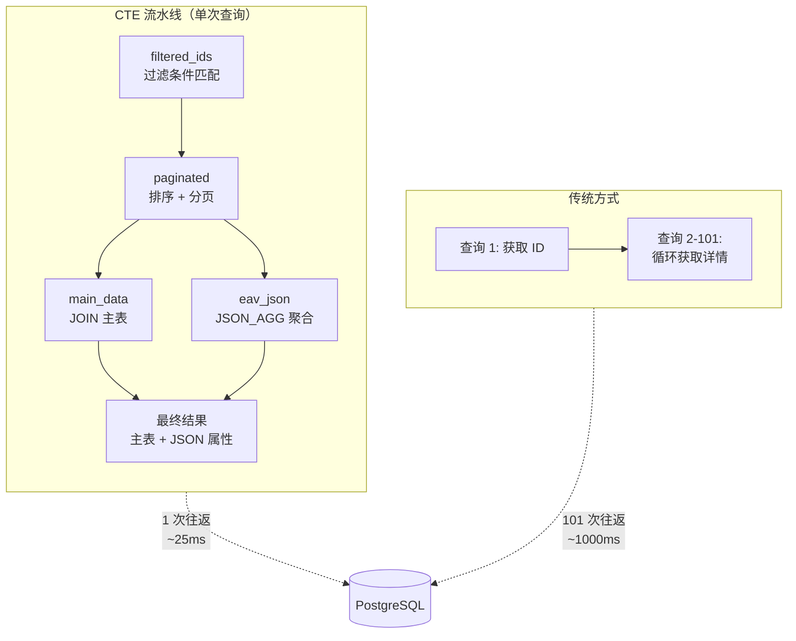

# 杀死 N+1：一次 SQL 优化如何让延迟从 1 秒降到 25 毫秒

> **Forma 工程博客 · 系列第二篇**

---

## TL;DR

我们将数据库查询次数从 **101 次减少到 1 次**，延迟从 **1000ms 降至 25ms**——降幅达 **97%**。秘诀不是什么黑魔法，而是一个被严重低估的 PostgreSQL 特性：**CTE + JSON_AGG**。

如果你正在用 EAV（Entity-Attribute-Value）模式存储灵活结构的数据，并且被 N+1 查询折磨得死去活来，这篇文章就是为你写的。

---

## 反派登场：N+1 查询的噩梦

先来看一个真实场景。

你的 SaaS 应用有一个"联系人"功能，不同客户的联系人字段完全不同：客户 A 需要 12 个字段，客户 B 需要 30 个字段，客户 C 每周都在改。为了避免每次加字段都要改表结构（`ALTER TABLE`），你选择了 EAV 模式——把属性存成行而不是列。

聪明的选择。但当你写查询代码时，噩梦开始了：

```go
// 步骤 1: 查询 EAV 表，获取符合条件的 row_id (1 次查询)
rowIDs := db.Query("SELECT DISTINCT row_id FROM eav_table WHERE ...")

// 步骤 2: 对每个 row_id 循环查询主表 (N 次查询!)
for _, rowID := range rowIDs {
    record := db.Query("SELECT * FROM entity_main WHERE row_id = ?", rowID)
    results = append(results, record)
}
```

这段代码看起来很直观，但它有一个致命问题：**查询 100 条记录需要 101 次数据库往返**。

让我们算笔账：

| 记录数 | 查询次数 | 单次往返延迟 | 总延迟 |
|--------|---------|-------------|--------|
| 10 条 | 11 次 | 10ms | **110ms** |
| 50 条 | 51 次 | 10ms | **510ms** |
| 100 条 | 101 次 | 10ms | **1010ms** |

一秒钟！用户点击"查询"按钮后要等一秒钟才能看到结果。更糟糕的是：

- **连接池耗尽**：高并发时，101 次查询会迅速吃光数据库连接
- **CPU 空转**：应用层在循环中不断等待网络 I/O
- **跨区域部署？翻倍！**：如果数据库在另一个区域，单次往返可能是 50ms，100 条记录就是 5 秒

这就是 N+1 查询——一个在 ORM 世界里臭名昭著的性能杀手。

---

## 英雄登场：让数据库做它擅长的事

问题的根源是什么？

**我们把"组装数据"的活交给了应用层**。应用层在循环中一条一条地问数据库："给我这条记录的详情"，数据库只能一条一条地回答。

但数据库本来就是干这个的啊！它有索引、有连接优化器、有向量化执行引擎——它天生就是用来批量处理数据的。

解决方案：**把循环搬到数据库里，一次查询返回所有数据**。

### CTE + JSON_AGG：一次查询搞定一切

PostgreSQL 的 CTE（Common Table Expression）和 JSON_AGG 函数是这个方案的核心。



先看完整 SQL，再解释原理：

```sql
WITH 
-- 步骤 1: 找出符合条件的记录 ID
filtered_ids AS (
    SELECT DISTINCT row_id
    FROM eav_table
    WHERE schema_id = $1 AND /* 过滤条件 */
),

-- 步骤 2: 排序 + 分页
paginated AS (
    SELECT row_id
    FROM filtered_ids
    ORDER BY /* 排序条件 */
    LIMIT $page_size OFFSET $offset
),

-- 步骤 3: 获取主表数据
main_data AS (
    SELECT m.*
    FROM paginated p
    JOIN entity_main m ON m.row_id = p.row_id
),

-- 步骤 4: 聚合 EAV 属性为 JSON
eav_json AS (
    SELECT 
        p.row_id,
        JSON_AGG(
            JSON_BUILD_OBJECT(
                'attr_id', e.attr_id,
                'value', COALESCE(e.value_text, e.value_numeric::text)
            )
        ) AS attributes
    FROM paginated p
    JOIN eav_table e ON e.row_id = p.row_id
    GROUP BY p.row_id
)

-- 最终结果: 主表 + EAV 属性，一次返回
SELECT m.*, COALESCE(e.attributes, '[]') AS attributes_json
FROM main_data m
LEFT JOIN eav_json e ON e.row_id = m.row_id;
```

### 这段 SQL 做了什么？

1. **CTE 链式处理**：每个 `WITH` 子句就像流水线上的一个工位，数据从上一步流到下一步
2. **JSON_AGG 魔法**：把多行 EAV 数据聚合成一个 JSON 数组，一个 `row_id` 对应一个 JSON
3. **一次往返**：整个查询只有一次数据库交互，所有数据打包返回

应用层只需要解析 JSON：

```go
// 一次查询，所有数据
rows := db.Query(cteSQL, schemaID, pageSize, offset)
for rows.Next() {
    var record Record
    var attributesJSON string
    rows.Scan(&record, &attributesJSON)
    json.Unmarshal(attributesJSON, &record.Attributes)
    results = append(results, record)
}
```

---

## 性能对比：数字不会说谎

优化前后的对比：

| 记录数 | 优化前查询次数 | 优化后查询次数 | 优化前延迟 | 优化后延迟 | 降幅 |
|--------|---------------|---------------|-----------|-----------|------|
| 10 条 | 11 次 | **1 次** | 110ms | **~15ms** | 86% |
| 50 条 | 51 次 | **1 次** | 510ms | **~20ms** | 96% |
| 100 条 | 101 次 | **1 次** | 1010ms | **~25ms** | **97%** |

在跨区域部署（单次往返 50ms）的场景下：

| 记录数 | 优化前延迟 | 优化后延迟 | 降幅 |
|--------|-----------|-----------|------|
| 100 条 | **5050ms** | **~80ms** | **98%** |

从 5 秒到 80 毫秒。用户体验从"这网站是不是挂了"变成"秒开"。

---

## 为什么这个方案有效？

### 1. 网络往返是最大的敌人

在现代系统中，CPU 和内存的速度以纳秒计，而网络往返以毫秒计——差了 **6 个数量级**。减少网络往返次数，往往比优化 CPU 计算更有效。

### 2. 数据库是数据处理专家

PostgreSQL 的查询优化器经过几十年的打磨，它知道如何高效地执行 JOIN、如何利用索引、如何并行处理。把数据聚合的工作交给它，比在应用层循环处理快得多。

### 3. JSON_AGG 是被低估的神器

很多人只把 PostgreSQL 当关系型数据库用，忘了它从 9.4 版本开始就是一个优秀的 JSON 数据库。`JSON_AGG` + `JSON_BUILD_OBJECT` 可以在数据库层面完成复杂的数据重组，避免在应用层做低效的循环拼接。

---

## 适用场景与限制

### 适合这个方案的场景

- **EAV 模式**：属性存储为行，需要聚合成记录
- **批量查询**：一次查询多条记录（分页列表、批量导出等）
- **网络延迟敏感**：数据库与应用不在同一机房

### 需要注意的限制

- **PostgreSQL 9.4+**：需要 `JSON_AGG` 和 `JSON_BUILD_OBJECT` 函数
- **复杂查询的可维护性**：CTE 嵌套过深会影响可读性，建议封装为视图或存储过程
- **内存使用**：`JSON_AGG` 会在内存中构建 JSON 数组，超大结果集需要注意内存限制

---

## 下一步：当数据量超过单机怎么办？

这篇文章解决了 N+1 查询问题，上一篇文章介绍了热表和 JSON Schema 的设计。但还有一个问题没有回答：

> 当历史数据积累到亿级，PostgreSQL 单机扛不住怎么办？

第三篇文章将介绍我们如何用 **DuckDB + CDC + Parquet** 构建 Serverless 湖仓架构，以及最关键的——如何解决大家对"Lakehouse 读脏数据"的信任危机。

---

**系列导航**

- [第一篇] 为什么 EAV 是 AI 时代最被低估的数据模型
- **[第二篇] 杀死 N+1：一次 SQL 优化如何让延迟从 1 秒降到 25 毫秒** ← 当前
- [第三篇] 零脏读的 Serverless 湖仓：我们如何用 DuckDB 解决一致性难题 → *即将发布*

---

*本文基于 [Forma](https://github.com/forma) 项目的工程实践。Forma 是一个为 AI 时代设计的灵活数据存储引擎。*
