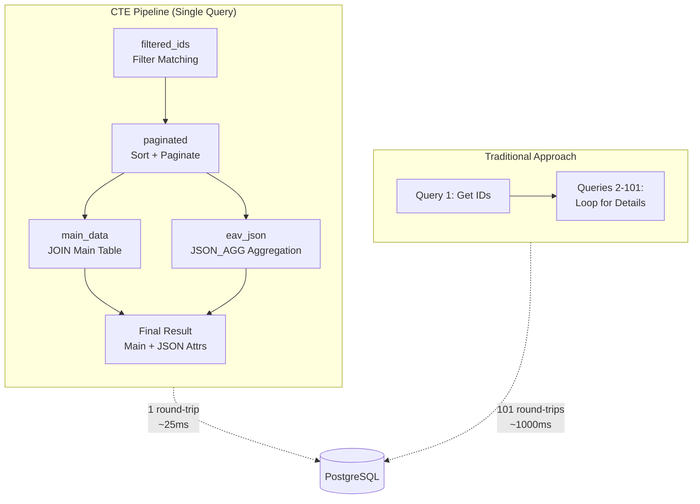

# Killing N+1: How One SQL Trick Cut Our Latency by 40x

> **Forma Engineering Blog · Series Part 2**

---

## TL;DR

We reduced database round-trips from **101 to 1**, and latency from **1000ms to 25ms**—a **97% improvement**. The secret isn't black magic; it's a criminally underrated PostgreSQL feature: **CTE + JSON_AGG**.

If you're using the EAV (Entity-Attribute-Value) pattern for flexible data storage and getting killed by N+1 queries, this post is for you.

---

## The Villain: The N+1 Query Nightmare

Let's set the scene.

Your SaaS app has a "Contacts" feature. Different customers need different fields: Customer A wants 12 fields, Customer B wants 30 fields, and Customer C changes their mind every week. To avoid running `ALTER TABLE` every time someone adds a field, you chose the EAV pattern—storing attributes as rows instead of columns.

Smart move. But when you write the query code, the nightmare begins:

```go
// Step 1: Query EAV table to get matching row IDs (1 query)
rowIDs := db.Query("SELECT DISTINCT row_id FROM eav_table WHERE ...")

// Step 2: Loop through each row_id to fetch main table data (N queries!)
for _, rowID := range rowIDs {
    record := db.Query("SELECT * FROM entity_main WHERE row_id = ?", rowID)
    results = append(results, record)
}
```

This code looks straightforward, but it has a fatal flaw: **fetching 100 records requires 101 database round-trips**.

Let's do the math:

| Records | Queries | Round-trip Latency | Total Latency |
|---------|---------|-------------------|---------------|
| 10 | 11 | 10ms | **110ms** |
| 50 | 51 | 10ms | **510ms** |
| 100 | 101 | 10ms | **1010ms** |

One full second! Users click "Search" and wait a full second for results. It gets worse:

- **Connection pool exhaustion**: Under high concurrency, 101 queries per request will drain your connection pool fast
- **CPU spinning**: The application layer spends most of its time waiting on network I/O in a loop
- **Cross-region deployment? Double it!**: If your database is in another region, a single round-trip might be 50ms. That's 5 seconds for 100 records.

This is the N+1 query problem—a notorious performance killer in the ORM world.

---

## The Hero: Let the Database Do What It's Good At

What's the root cause?

**We're making the application layer assemble the data.** The app loops through records, asking the database one by one: "Give me the details for this record." The database can only respond one by one.

But the database was *born* to do this! It has indexes, query optimizers, and vectorized execution engines—it's designed for batch data processing.

The solution: **Move the loop into the database. Return all data in one query.**

### CTE + JSON_AGG: One Query to Rule Them All

PostgreSQL's CTE (Common Table Expression) and JSON_AGG function are the core of this solution.



Let's see the complete SQL first, then explain the mechanics:

```sql
WITH 
-- Step 1: Find matching record IDs
filtered_ids AS (
    SELECT DISTINCT row_id
    FROM eav_table
    WHERE schema_id = $1 AND /* filter conditions */
),

-- Step 2: Sort + Paginate
paginated AS (
    SELECT row_id
    FROM filtered_ids
    ORDER BY /* sort conditions */
    LIMIT $page_size OFFSET $offset
),

-- Step 3: Fetch main table data
main_data AS (
    SELECT m.*
    FROM paginated p
    JOIN entity_main m ON m.row_id = p.row_id
),

-- Step 4: Aggregate EAV attributes into JSON
eav_json AS (
    SELECT 
        p.row_id,
        JSON_AGG(
            JSON_BUILD_OBJECT(
                'attr_id', e.attr_id,
                'value', COALESCE(e.value_text, e.value_numeric::text)
            )
        ) AS attributes
    FROM paginated p
    JOIN eav_table e ON e.row_id = p.row_id
    GROUP BY p.row_id
)

-- Final result: main table + EAV attributes, returned in one shot
SELECT m.*, COALESCE(e.attributes, '[]') AS attributes_json
FROM main_data m
LEFT JOIN eav_json e ON e.row_id = m.row_id;
```

### What Does This SQL Do?

1. **CTE as a pipeline**: Each `WITH` clause is like a station on an assembly line, with data flowing from one step to the next
2. **JSON_AGG magic**: Aggregates multiple EAV rows into a single JSON array—one `row_id`, one JSON object
3. **One round-trip**: The entire query involves only one database interaction; all data comes back in a single package

The application layer just needs to parse JSON:

```go
// One query, all data
rows := db.Query(cteSQL, schemaID, pageSize, offset)
for rows.Next() {
    var record Record
    var attributesJSON string
    rows.Scan(&record, &attributesJSON)
    json.Unmarshal(attributesJSON, &record.Attributes)
    results = append(results, record)
}
```

---

## Performance Comparison: Numbers Don't Lie

Before vs. after optimization:

| Records | Queries (Before) | Queries (After) | Latency (Before) | Latency (After) | Improvement |
|---------|-----------------|-----------------|------------------|-----------------|-------------|
| 10 | 11 | **1** | 110ms | **~15ms** | 86% |
| 50 | 51 | **1** | 510ms | **~20ms** | 96% |
| 100 | 101 | **1** | 1010ms | **~25ms** | **97%** |

In cross-region deployments (50ms per round-trip):

| Records | Latency (Before) | Latency (After) | Improvement |
|---------|------------------|-----------------|-------------|
| 100 | **5050ms** | **~80ms** | **98%** |

From 5 seconds to 80 milliseconds. User experience goes from "Is this site down?" to "Instant."

---

## Why Does This Work?

### 1. Network Round-Trips Are the Enemy

In modern systems, CPU and memory speeds are measured in nanoseconds, while network round-trips are measured in milliseconds—a difference of **6 orders of magnitude**. Reducing network round-trips is often more effective than optimizing CPU computations.

### 2. The Database Is a Data Processing Expert

PostgreSQL's query optimizer has been refined over decades. It knows how to execute JOINs efficiently, how to leverage indexes, and how to parallelize operations. Delegating data aggregation to the database is far faster than looping in application code.

### 3. JSON_AGG Is an Underrated Superpower

Many people treat PostgreSQL as just a relational database, forgetting that since version 9.4, it's also an excellent JSON database. `JSON_AGG` + `JSON_BUILD_OBJECT` can perform complex data reshaping at the database layer, avoiding inefficient loop-based assembly in application code.

---

## When to Use This (and When Not To)

### Good Fit

- **EAV pattern**: Attributes stored as rows that need to be aggregated into records
- **Batch queries**: Fetching multiple records at once (paginated lists, bulk exports, etc.)
- **Latency-sensitive**: Database and application not co-located

### Limitations

- **PostgreSQL 9.4+**: Requires `JSON_AGG` and `JSON_BUILD_OBJECT` functions
- **Complex query maintainability**: Deeply nested CTEs can hurt readability; consider encapsulating in views or stored procedures
- **Memory usage**: `JSON_AGG` builds JSON arrays in memory; watch out for memory limits with very large result sets

---

## What's Next: When Data Exceeds a Single Machine?

This post solved the N+1 query problem, and the previous post introduced hot table and JSON Schema design. But one question remains:

> When historical data accumulates to billions of records and a single PostgreSQL instance can't handle it—what then?

Part 3 will introduce how we use **DuckDB + CDC + Parquet** to build a Serverless lakehouse architecture, and most critically—how we solve the trust crisis around "Lakehouse reading dirty data."

---

**Series Navigation**

- [Part 1] Why EAV is the Most Underrated Data Model for AI
- **[Part 2] Killing N+1: How One SQL Trick Cut Our Latency by 40x** ← You are here
- [Part 3] Zero Dirty Reads: Building a Trustworthy Lakehouse with DuckDB → *Coming soon*

---

*This post is based on engineering practices from the [Forma](https://github.com/forma) project. Forma is a flexible data storage engine designed for the AI era.*
