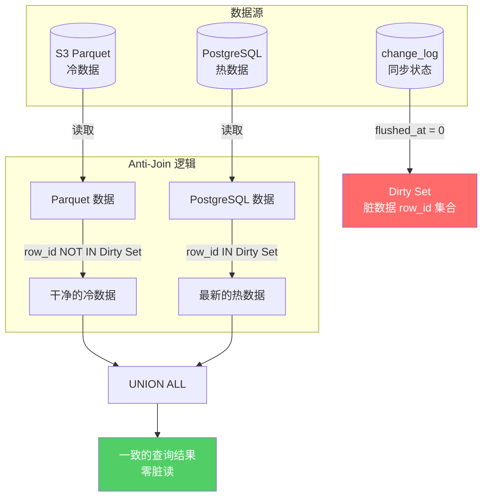

# 零脏读的 Serverless 湖仓：我们如何用 DuckDB 解决一致性难题

> **Forma 工程博客 · 系列第三篇（完结）**

---

## TL;DR

"Lakehouse"听起来很美好，但大家心里都有一个疑问：**我怎么知道查出来的数据不是脏的？**

这篇文章解释 Forma 如何用 **Anti-Join（反连接）+ Dirty Set（脏数据集）** 机制，确保联邦查询**永远不会读到未提交或不一致的数据**。

PostgreSQL 负责"当下"，DuckDB + Parquet 负责"历史"——两者协同，零脏读。

---

## 为什么需要 Lakehouse？

前两篇文章解决了 OLTP 场景的问题：
- **第一篇**：用热表 + JSON Schema 实现 AI-Ready 的灵活存储
- **第二篇**：用 CTE + JSON_AGG 消灭 N+1 查询，延迟从 1 秒降到 25 毫秒

但有一个问题我们一直没正面回答：

> 当数据量达到亿级，PostgreSQL 单机扛不住怎么办？

即使有了热表索引，当 EAV 表膨胀到 1 亿行、Parquet 化的历史数据达到 TB 级，单机 PostgreSQL 的内存和 I/O 都会成为瓶颈。

更重要的是，**历史数据的访问模式与实时数据完全不同**：

| 数据类型 | 访问频率 | 访问模式 | 典型场景 | 占查询量 |
|---------|---------|---------|---------|---------|
| 最近 7 天 | 每秒数百次 | 点查、过滤、分页 | 日常操作 | ~80% |
| 7-90 天 | 每天数十次 | 批量导出、报表 | 月度分析 | ~15% |
| 90 天以上 | 每月数次 | 全量扫描、聚合 | 年度审计 | ~5% |

为最近 7 天的数据优化，却让它和 3 年的历史数据挤在同一张表里——这是资源浪费。

### 湖仓架构的诱惑

解决方案似乎很明显：**冷热分离**。

- **热数据**：留在 PostgreSQL，享受事务一致性和低延迟索引
- **冷数据**：导出到 Parquet 文件，存在 S3，用 OLAP 引擎查询

架构图看起来很美：

```
┌─────────────────────────────────────────────────────────────┐
│                       查询路由                               │
└─────────────────────────────────────────────────────────────┘
                    │                    │
                    ▼                    ▼
        ┌───────────────────┐  ┌───────────────────┐
        │    PostgreSQL     │  │      DuckDB       │
        │   （热数据）        │  │   （冷数据）       │
        │   最近 7 天        │  │   Parquet on S3   │
        └───────────────────┘  └───────────────────┘
```

但是——

**每个听到"Lakehouse"的工程师心里都有一个声音：**

> "等等，如果同一条记录同时存在于 PostgreSQL 和 Parquet 里，我查出来的到底是哪个版本？如果 PostgreSQL 里的数据还没同步到 Parquet，我会不会读到旧数据？或者更糟——重复数据？"

这就是**一致性恐惧**。它是阻止很多团队采用 Lakehouse 架构的最大心理障碍。

---

## 一致性恐惧的根源

让我们把问题具体化。

假设有一条记录 `row_id = 123`：
- **09:00**：用户创建这条记录，写入 PostgreSQL
- **09:05**：CDC 作业将这条记录导出到 Parquet
- **09:10**：用户更新这条记录（PostgreSQL 中的值变了）
- **09:15**：用户发起查询

问题来了：**09:15 的查询应该返回哪个版本？**

| 数据源 | row_id | 版本 | 状态 |
|-------|--------|------|------|
| PostgreSQL | 123 | v2 | 最新（09:10 更新） |
| Parquet | 123 | v1 | 过时（09:05 导出） |

如果查询引擎天真地"合并"两个数据源，用户可能会看到：
- **重复**：同一条记录出现两次（v1 和 v2）
- **脏读**：返回 v1（过时版本）
- **幻读**：有时返回 v1，有时返回 v2，取决于查询时机

这些都是不可接受的。

### 为什么简单的时间戳比较不够？

你可能会想：用 `updated_at` 时间戳做去重不就行了？

```sql
SELECT * FROM (
    SELECT *, 'pg' AS source FROM postgres_data
    UNION ALL
    SELECT *, 's3' AS source FROM parquet_data
)
WHERE row_number() OVER (PARTITION BY row_id ORDER BY updated_at DESC) = 1
```

这个方案有几个致命问题：

1. **时钟偏差**：PostgreSQL 和 CDC 作业的时钟可能有毫秒级偏差
2. **竞态条件**：记录在"导出中"的瞬间被更新，`updated_at` 可能相同
3. **软删除陷阱**：如果记录在 PostgreSQL 中被删除，Parquet 里的旧版本会"复活"

时间戳比较是**乐观**的——它假设时间戳能完美反映数据新旧。但在分布式系统中，这种假设很危险。

---

## Forma 的解法：Anti-Join + Dirty Set

Forma 采用一种**悲观**的策略：**不信任时间戳，只信任状态**。

核心思想是引入一个"脏数据集"（Dirty Set）：

> **如果一条记录在 PostgreSQL 中"还没落盘到 Parquet"，那么无论 Parquet 里有没有这条记录，都忽略 Parquet 版本，只用 PostgreSQL 版本。**

### change_log 表：脏数据的源头

Forma 在 PostgreSQL 中维护一张 `change_log` 表：

```sql
CREATE TABLE change_log (
    id          BIGSERIAL PRIMARY KEY,
    schema_id   UUID,
    row_id      UUID,
    op          SMALLINT,  -- 1=INSERT, 2=UPDATE, 3=DELETE
    created_at  BIGINT,    -- 变更时间戳
    flushed_at  BIGINT     -- 导出时间戳；0 = 未导出
);
```

关键字段是 `flushed_at`：
- `flushed_at = 0`：这条变更**还没同步到 Parquet**——数据是"脏"的
- `flushed_at > 0`：这条变更**已经同步到 Parquet**——数据是"干净"的

### 查询时的 Anti-Join 逻辑

当用户发起查询时，Forma 的 DuckDB 查询引擎执行以下逻辑：



SQL 实现：

```sql
-- 步骤 1: 获取脏数据集（还没落盘的 row_id）
dirty_ids AS (
    SELECT row_id
    FROM change_log
    WHERE flushed_at = 0 AND schema_id = $SCHEMA_ID
),

-- 步骤 2: 从 Parquet 读取数据，但排除脏数据集中的记录
s3_clean AS (
    SELECT *
    FROM read_parquet('s3://bucket/data/*.parquet')
    WHERE row_id NOT IN (SELECT row_id FROM dirty_ids)  -- Anti-Join!
),

-- 步骤 3: 从 PostgreSQL 读取脏数据（最新版本）
pg_hot AS (
    SELECT *
    FROM postgres_scan('SELECT * FROM entity_main WHERE ...')
    WHERE row_id IN (SELECT row_id FROM dirty_ids)
),

-- 步骤 4: 合并
SELECT * FROM s3_clean
UNION ALL
SELECT * FROM pg_hot
```

用公式表示：

$$Result = (Parquet_{data} \setminus DirtySet) \cup PostgreSQL_{hot}$$

翻译成人话：
1. **Parquet 数据**：只保留那些"已经落盘、没有更新版本"的记录
2. **PostgreSQL 数据**：只保留那些"还没落盘、或者刚刚更新"的记录
3. **合并**：两者并集，保证每条记录只出现一次，且是最新版本

### 为什么这个方案是"悲观"且安全的？

关键洞察：**我们不依赖时间戳判断新旧，而是依赖"是否已同步"这个明确的状态。**

| 场景 | Dirty Set | Parquet | PostgreSQL | 返回 |
|------|-----------|---------|------------|------|
| 记录只在 PG | row_id ∈ Dirty | 无 | 有 | PG 版本 |
| 记录已同步，无更新 | row_id ∉ Dirty | 有 | 有（相同） | Parquet 版本 |
| 记录已同步，有更新 | row_id ∈ Dirty | 有（旧） | 有（新） | PG 版本 |
| 记录在 PG 删除 | row_id ∈ Dirty | 有（旧） | 无 | 不返回 |

无论什么场景，用户永远看到的是**最新、一致的数据**。

---

## 类比：快递还在路上的订单

如果上面的解释太抽象，这里有一个生活化的类比：

想象你经营一家网店，有两本账本：
- **本地账本**（PostgreSQL）：每笔订单实时记录
- **云端账本**（Parquet）：每天晚上把本地账本同步到云端

现在有人问你："今天的销售额是多少？"

**错误做法**：把本地账本和云端账本的数字加起来。
- 问题：如果有些订单"还在同步中"，你会重复计算。

**正确做法**：
1. 先看哪些订单"还没同步到云端"（脏数据集）
2. 云端账本的数据，排除这些"还在路上"的订单
3. 本地账本的数据，只算这些"还在路上"的订单
4. 两者相加

这就是 Anti-Join + Dirty Set 的逻辑。

---

## CDC 流程：数据如何从 PostgreSQL 流向 Parquet

理解了查询逻辑，让我们看看数据是如何同步的。

### 写入时：记录变更

每次写入 `entity_main` 或 `eav_data` 时，同步插入 `change_log`：

```sql
-- 应用写入数据
INSERT INTO entity_main (...) VALUES (...);
INSERT INTO eav_data (...) VALUES (...);

-- 记录变更（flushed_at = 0 表示未导出）
INSERT INTO change_log (schema_id, row_id, op, created_at, flushed_at)
VALUES ($schema_id, $row_id, 1, now(), 0);
```

### CDC 作业：增量导出

CDC 作业定期运行（默认每分钟）：

```sql
-- 1. 找出待导出的 row_id
SELECT DISTINCT row_id FROM change_log 
WHERE schema_id = $SCHEMA_ID AND flushed_at = 0;

-- 2. 读取完整记录，展平 EAV 为宽表
SELECT m.row_id, m.text_01 AS name, m.integer_01 AS age, ...
FROM entity_main m
LEFT JOIN eav_data e ON m.row_id = e.row_id
WHERE m.row_id IN ($PENDING_IDS);

-- 3. 写入 Parquet
COPY (...) TO 's3://bucket/delta/<uuid>.parquet';

-- 4. 标记已导出
UPDATE change_log SET flushed_at = now() 
WHERE row_id IN ($PENDING_IDS) AND flushed_at = 0;
```

### 数据流全景图

```
┌─────────────────────────────────────────────────────────────────────┐
│                            写入路径                                  │
│  Application ──▶ entity_main + eav_data ──▶ change_log (flushed=0)  │
└─────────────────────────────────────────────────────────────────────┘
                                    │
                                    ▼
┌─────────────────────────────────────────────────────────────────────┐
│                          CDC 导出作业                                │
│  1. 扫描 change_log WHERE flushed_at = 0                            │
│  2. 读取并展平 EAV → 宽表                                            │
│  3. 写入 S3 Parquet                                                 │
│  4. 更新 change_log SET flushed_at = now()                          │
└─────────────────────────────────────────────────────────────────────┘
                                    │
                                    ▼
┌─────────────────────────────────────────────────────────────────────┐
│                          查询路径                                    │
│  DuckDB: (Parquet - DirtySet) ∪ (PostgreSQL ∩ DirtySet)             │
└─────────────────────────────────────────────────────────────────────┘
```

---

## Last-Write-Wins：处理残留重复

Anti-Join 解决了"PostgreSQL vs Parquet"的冲突。但 Parquet 内部呢？

由于 CDC 是增量导出，同一条记录可能在多个 Parquet 文件中存在多个版本：
- `delta/001.parquet`：row_id=123, version=1
- `delta/002.parquet`：row_id=123, version=2

Forma 用 `QUALIFY ROW_NUMBER()` 实现 Last-Write-Wins：

```sql
SELECT *
FROM (
    SELECT *, 
           ROW_NUMBER() OVER (PARTITION BY row_id ORDER BY updated_at DESC) AS rn
    FROM read_parquet('s3://bucket/**/*.parquet')
)
WHERE rn = 1
  AND (deleted_at IS NULL OR deleted_at = 0)  -- 过滤软删除
```

这确保每个 `row_id` 只返回最新版本，且已删除的记录不会"复活"。

---

## 为什么选择 DuckDB？

你可能会问：为什么用 DuckDB 而不是 Trino、Spark、或者直接用 PostgreSQL 的 FDW？

### DuckDB 的优势

| 特性 | DuckDB | Trino/Spark | PostgreSQL FDW |
|------|--------|-------------|----------------|
| 部署复杂度 | **嵌入式，零部署** | 需要 3-10 节点集群 | 需要配置 FDW 扩展 |
| 冷启动延迟 | **50-100ms** | 2-10 秒（JVM 预热） | 毫秒级（复用连接） |
| Parquet 原生支持 | **原生，向量化执行** | 好（需要 connector） | 需要 parquet_fdw 插件 |
| PostgreSQL 连接 | **postgres_scanner** | JDBC（额外延迟 10-50ms） | 内置 |
| 成本模型 | **按查询付费友好** | 集群常驻 $500-5000/月 | 依赖主库资源 |

DuckDB 是一个**嵌入式 OLAP 引擎**——它可以直接嵌入到你的应用进程中，不需要额外的服务器。这对 Serverless 架构特别友好：

- Lambda 函数启动时加载 DuckDB（~50MB）
- 查询时直连 PostgreSQL（通过 `postgres_scanner`）和 S3（通过 `httpfs`）
- 查询结束，Lambda 销毁，成本归零

### Serverless 成本模型

传统 OLAP 架构需要常驻集群，即使没有查询也在烧钱。DuckDB 嵌入式的特点让我们实现了真正的按需计费：

| 成本项 | 传统 OLAP 集群 | DuckDB Serverless |
|-------|---------------|-------------------|
| 空闲成本 | $500-5000/月 | **$0** |
| 单次查询（1GB 扫描） | ~$0.001 | ~$0.005（含 Lambda） |
| 月均 1000 次查询 | $500-5000 | **~$5-10** |

对于查询量不大但数据量大的场景（历史审计、月度报表），Serverless 成本优势可达 **100-500 倍**。

---

## 系列总结：三角平衡

让我们回顾这三篇文章构建的完整架构：

```
                        ┌─────────────────┐
                        │    灵活性        │
                        │  EAV + JSON     │
                        │    Schema       │
                        └────────┬────────┘
                                 │
                 ┌───────────────┼───────────────┐
                 │               │               │
                 ▼               │               ▼
        ┌─────────────────┐     │      ┌─────────────────┐
        │     性能        │     │      │     成本        │
        │  热表 + CTE     │◀────┴─────▶│  DuckDB +       │
        │  JSON_AGG      │            │  Serverless     │
        └─────────────────┘            └─────────────────┘
```

### 三篇文章解决的问题

| 篇目 | 问题 | 解决方案 | 关键指标 |
|------|------|---------|---------|
| **第一篇** | Schema 灵活性 | EAV + JSON Schema + 热表 | 零 DDL，80/20 索引优化 |
| **第二篇** | N+1 查询 | CTE + JSON_AGG | 101→1 查询，1000ms→25ms |
| **第三篇** | 海量历史数据 | DuckDB + Anti-Join | 零脏读，Serverless 成本 |

### 核心设计原则

1. **状态优先于时间戳**：用 `flushed_at` 明确标记同步状态，而不是依赖时间戳比较
2. **悲观优于乐观**：宁可多查一次 PostgreSQL，也不冒读脏数据的风险
3. **计算下推**：让数据库（PostgreSQL）和分析引擎（DuckDB）各司其职
4. **渐进降级**：DuckDB 失败时回退到 PG-only，保证可用性

### 适用场景

这套架构特别适合：
- **AI 驱动的应用**：数据结构频繁变化，需要 JSON Schema 的灵活性
- **多租户 SaaS**：不同租户不同字段，EAV 天然支持
- **分析型查询**：历史数据聚合、报表、导出，DuckDB + Parquet 高效处理

### 不适用场景

- **强事务一致性**：需要跨表 ACID 事务的场景，建议纯 PostgreSQL
- **超低延迟**：<10ms 的点查，建议 Redis 缓存 + PostgreSQL
- **实时流处理**：CDC 有分钟级延迟，实时流用 Kafka/Flink

---

## 结语

"Lakehouse"不是一个新概念，但让人**信任**它确实难。

Forma 的 Anti-Join + Dirty Set 机制，本质上是一个**悲观的一致性协议**：我们假设任何时候都可能有数据"在路上"，然后显式地处理这种不确定性。

这比乐观的时间戳比较多了一些查询开销（需要扫描 `change_log` 表），但换来的是**可证明的一致性保证**。

在数据系统中，**正确性永远比性能重要**——因为错误的快速结果，比正确的慢结果更糟糕。

---

**系列导航**

- [第一篇] 为什么 EAV 是 AI 时代最被低估的数据模型
- [第二篇] 杀死 N+1：一次 SQL 优化如何让延迟从 1 秒降到 25 毫秒
- **[第三篇] 零脏读的 Serverless 湖仓：我们如何用 DuckDB 解决一致性难题** ← 当前（完结）

---

*本文基于 [Forma](https://github.com/forma) 项目的工程实践。Forma 是一个为 AI 时代设计的灵活数据存储引擎。*

*如果你对这套架构感兴趣，欢迎在 GitHub 上 Star 我们，或者加入社区讨论。*
