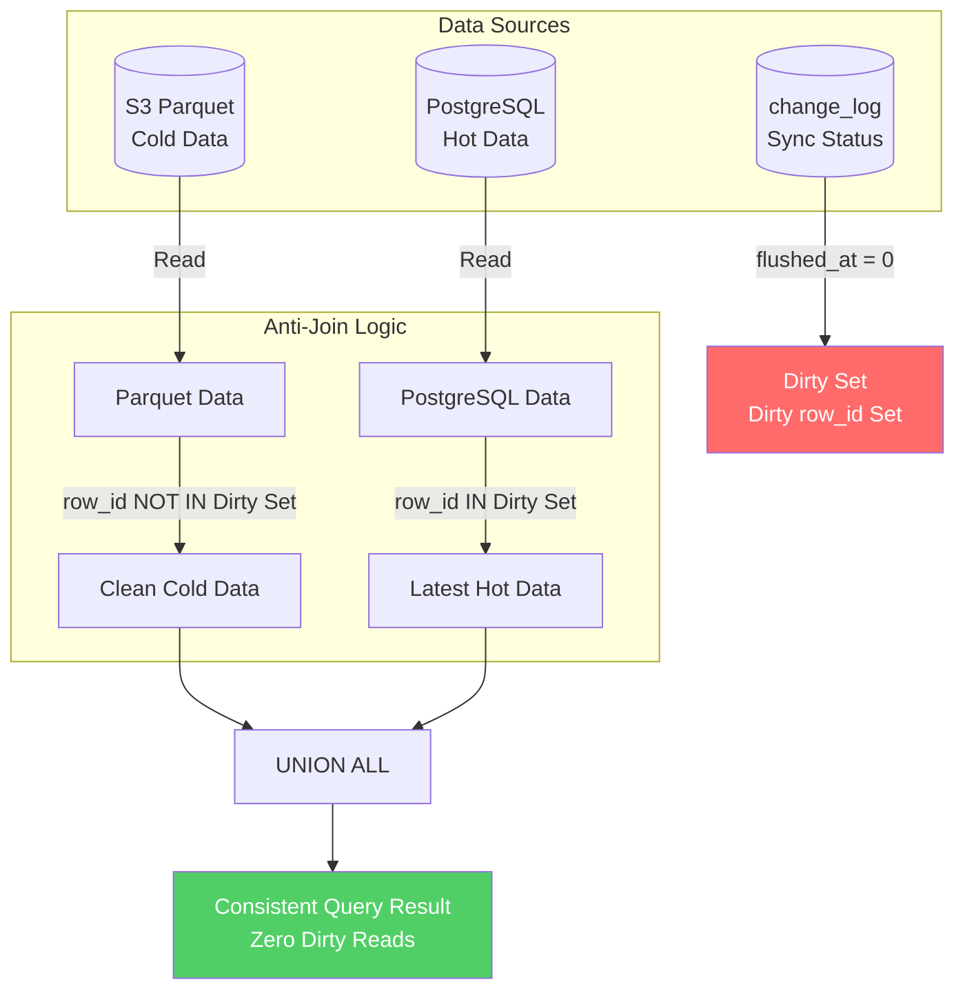

# Zero Dirty Reads: Building a Trustworthy Lakehouse with DuckDB

> **Forma Engineering Blog · Series Part 3 (Finale)**

---

## TL;DR

"Lakehouse" sounds great, but every engineer has the same nagging question: **How do I know the data I'm querying isn't stale or dirty?**

This post explains how Forma uses **Anti-Join + Dirty Set** mechanisms to ensure federated queries **never read uncommitted or inconsistent data**.

PostgreSQL handles "the present," DuckDB + Parquet handles "the past"—working together, zero dirty reads.

---

## Why Do We Need a Lakehouse?

The first two posts solved OLTP scenarios:
- **Part 1**: Achieved AI-Ready flexible storage with hot tables + JSON Schema
- **Part 2**: Killed N+1 queries with CTE + JSON_AGG, reducing latency from 1 second to 25 milliseconds

But there's one question we haven't directly addressed:

> When data reaches billions of records and a single PostgreSQL instance can't handle it—what then?

Even with hot table indexes, when the EAV table balloons to 100 million rows and historical data in Parquet reaches terabytes, single-machine PostgreSQL's memory and I/O become bottlenecks.

More importantly, **historical data access patterns are completely different from real-time data**:

| Data Type | Access Frequency | Access Pattern | Typical Scenario | Query Share |
|-----------|------------------|----------------|-----------------|-------------|
| Last 7 days | Hundreds/second | Point queries, filtering, pagination | Daily operations | ~80% |
| 7-90 days | Dozens/day | Bulk exports, reports | Monthly analysis | ~15% |
| 90+ days | Few times/month | Full scans, aggregations | Annual audits | ~5% |

Optimizing for the last 7 days while cramming it alongside 3 years of historical data in the same table—that's resource waste.

### The Allure of Lakehouse Architecture

The solution seems obvious: **hot/cold separation**.

- **Hot data**: Keep in PostgreSQL, enjoy transactional consistency and low-latency indexes
- **Cold data**: Export to Parquet files, store in S3, query with an OLAP engine

The architecture diagram looks beautiful:

```
┌─────────────────────────────────────────────────────────────┐
│                       Query Router                           │
└─────────────────────────────────────────────────────────────┘
                    │                    │
                    ▼                    ▼
        ┌───────────────────┐  ┌───────────────────┐
        │    PostgreSQL     │  │      DuckDB       │
        │    (Hot Data)     │  │    (Cold Data)    │
        │    Last 7 days    │  │   Parquet on S3   │
        └───────────────────┘  └───────────────────┘
```

But—

**Every engineer who hears "Lakehouse" has a voice in their head:**

> "Wait, if the same record exists in both PostgreSQL and Parquet, which version do I get? If PostgreSQL data hasn't synced to Parquet yet, will I read stale data? Or worse—duplicate data?"

This is the **consistency fear**. It's the biggest psychological barrier preventing many teams from adopting Lakehouse architecture.

---

## The Root of Consistency Fear

Let's make the problem concrete.

Suppose there's a record `row_id = 123`:
- **09:00**: User creates this record, writes to PostgreSQL
- **09:05**: CDC job exports this record to Parquet
- **09:10**: User updates this record (PostgreSQL value changes)
- **09:15**: User issues a query

The question: **Which version should the 09:15 query return?**

| Data Source | row_id | Version | Status |
|-------------|--------|---------|--------|
| PostgreSQL | 123 | v2 | Latest (09:10 update) |
| Parquet | 123 | v1 | Stale (09:05 export) |

If the query engine naively "merges" both data sources, users might see:
- **Duplicates**: Same record appears twice (v1 and v2)
- **Dirty reads**: Returns v1 (stale version)
- **Phantom reads**: Sometimes v1, sometimes v2, depending on query timing

None of these are acceptable.

### Why Simple Timestamp Comparison Isn't Enough

You might think: Just use `updated_at` timestamps for deduplication, right?

```sql
SELECT * FROM (
    SELECT *, 'pg' AS source FROM postgres_data
    UNION ALL
    SELECT *, 's3' AS source FROM parquet_data
)
WHERE row_number() OVER (PARTITION BY row_id ORDER BY updated_at DESC) = 1
```

This approach has several fatal flaws:

1. **Clock skew**: PostgreSQL and CDC job clocks may differ by milliseconds
2. **Race conditions**: If a record is updated during "export in progress," `updated_at` might be identical
3. **Soft delete trap**: If a record is deleted in PostgreSQL, the old version in Parquet might "resurrect"

Timestamp comparison is **optimistic**—it assumes timestamps perfectly reflect data freshness. In distributed systems, this assumption is dangerous.

---

## Forma's Solution: Anti-Join + Dirty Set

Forma adopts a **pessimistic** strategy: **Don't trust timestamps, trust state.**

The core idea is introducing a "Dirty Set":

> **If a record in PostgreSQL "hasn't been flushed to Parquet yet," then regardless of whether Parquet has this record, ignore the Parquet version and use only the PostgreSQL version.**

### The change_log Table: Source of Dirty Data

Forma maintains a `change_log` table in PostgreSQL:

```sql
CREATE TABLE change_log (
    id          BIGSERIAL PRIMARY KEY,
    schema_id   UUID,
    row_id      UUID,
    op          SMALLINT,  -- 1=INSERT, 2=UPDATE, 3=DELETE
    created_at  BIGINT,    -- Change timestamp
    flushed_at  BIGINT     -- Export timestamp; 0 = not exported
);
```

The key field is `flushed_at`:
- `flushed_at = 0`: This change **hasn't synced to Parquet**—data is "dirty"
- `flushed_at > 0`: This change **has synced to Parquet**—data is "clean"

### Anti-Join Logic at Query Time

When a user issues a query, Forma's DuckDB query engine executes this logic:



SQL implementation:

```sql
-- Step 1: Get dirty set (row_ids not yet flushed)
dirty_ids AS (
    SELECT row_id
    FROM change_log
    WHERE flushed_at = 0 AND schema_id = $SCHEMA_ID
),

-- Step 2: Read from Parquet, but exclude records in dirty set
s3_clean AS (
    SELECT *
    FROM read_parquet('s3://bucket/data/*.parquet')
    WHERE row_id NOT IN (SELECT row_id FROM dirty_ids)  -- Anti-Join!
),

-- Step 3: Read dirty data from PostgreSQL (latest version)
pg_hot AS (
    SELECT *
    FROM postgres_scan('SELECT * FROM entity_main WHERE ...')
    WHERE row_id IN (SELECT row_id FROM dirty_ids)
),

-- Step 4: Merge
SELECT * FROM s3_clean
UNION ALL
SELECT * FROM pg_hot
```

Expressed as a formula:

$$Result = (Parquet_{data} \setminus DirtySet) \cup PostgreSQL_{hot}$$

In plain English:
1. **Parquet data**: Keep only records that "have been flushed and have no newer version"
2. **PostgreSQL data**: Keep only records that "haven't been flushed or were just updated"
3. **Merge**: Union of both ensures each record appears exactly once, always the latest version

### Why This Approach Is "Pessimistic" and Safe

The key insight: **We don't rely on timestamps to judge freshness—we rely on the explicit state of "has it synced or not."**

| Scenario | Dirty Set | Parquet | PostgreSQL | Returns |
|----------|-----------|---------|------------|---------|
| Record only in PG | row_id ∈ Dirty | None | Exists | PG version |
| Record synced, no updates | row_id ∉ Dirty | Exists | Exists (same) | Parquet version |
| Record synced, then updated | row_id ∈ Dirty | Exists (old) | Exists (new) | PG version |
| Record deleted in PG | row_id ∈ Dirty | Exists (old) | None | Not returned |

No matter the scenario, users always see **the latest, consistent data**.

---

## Analogy: Orders Still in Transit

If the explanation above is too abstract, here's a real-world analogy:

Imagine you run an online store with two ledgers:
- **Local ledger** (PostgreSQL): Every order recorded in real-time
- **Cloud ledger** (Parquet): Local ledger synced to cloud every night

Now someone asks: "What's today's total sales?"

**Wrong approach**: Add up numbers from both local and cloud ledgers.
- Problem: If some orders are "still syncing," you'll double-count.

**Correct approach**:
1. First, check which orders "haven't synced to cloud yet" (dirty set)
2. Cloud ledger data: exclude these "in-transit" orders
3. Local ledger data: only count these "in-transit" orders
4. Add both together

That's the Anti-Join + Dirty Set logic.

---

## CDC Flow: How Data Moves from PostgreSQL to Parquet

Now that we understand query logic, let's see how data syncs.

### On Write: Record Changes

Every write to `entity_main` or `eav_data` simultaneously inserts into `change_log`:

```sql
-- Application writes data
INSERT INTO entity_main (...) VALUES (...);
INSERT INTO eav_data (...) VALUES (...);

-- Record change (flushed_at = 0 means not exported)
INSERT INTO change_log (schema_id, row_id, op, created_at, flushed_at)
VALUES ($schema_id, $row_id, 1, now(), 0);
```

### CDC Job: Incremental Export

The CDC job runs periodically (default: every minute):

```sql
-- 1. Find row_ids pending export
SELECT DISTINCT row_id FROM change_log 
WHERE schema_id = $SCHEMA_ID AND flushed_at = 0;

-- 2. Read complete records, flatten EAV to wide table
SELECT m.row_id, m.text_01 AS name, m.integer_01 AS age, ...
FROM entity_main m
LEFT JOIN eav_data e ON m.row_id = e.row_id
WHERE m.row_id IN ($PENDING_IDS);

-- 3. Write to Parquet
COPY (...) TO 's3://bucket/delta/<uuid>.parquet';

-- 4. Mark as exported
UPDATE change_log SET flushed_at = now() 
WHERE row_id IN ($PENDING_IDS) AND flushed_at = 0;
```

### Full Data Flow Diagram

```
┌─────────────────────────────────────────────────────────────────────┐
│                            Write Path                                │
│  Application ──▶ entity_main + eav_data ──▶ change_log (flushed=0)   │
└─────────────────────────────────────────────────────────────────────┘
                                    │
                                    ▼
┌─────────────────────────────────────────────────────────────────────┐
│                          CDC Export Job                              │
│  1. Scan change_log WHERE flushed_at = 0                            │
│  2. Read and flatten EAV → wide table                                │
│  3. Write to S3 Parquet                                              │
│  4. Update change_log SET flushed_at = now()                         │
└─────────────────────────────────────────────────────────────────────┘
                                    │
                                    ▼
┌─────────────────────────────────────────────────────────────────────┐
│                           Query Path                                 │
│  DuckDB: (Parquet - DirtySet) ∪ (PostgreSQL ∩ DirtySet)              │
└─────────────────────────────────────────────────────────────────────┘
```

---

## Last-Write-Wins: Handling Residual Duplicates

Anti-Join solves "PostgreSQL vs Parquet" conflicts. But what about within Parquet itself?

Since CDC exports incrementally, the same record might exist in multiple Parquet files with different versions:
- `delta/001.parquet`: row_id=123, version=1
- `delta/002.parquet`: row_id=123, version=2

Forma uses `QUALIFY ROW_NUMBER()` to implement Last-Write-Wins:

```sql
SELECT *
FROM (
    SELECT *, 
           ROW_NUMBER() OVER (PARTITION BY row_id ORDER BY updated_at DESC) AS rn
    FROM read_parquet('s3://bucket/**/*.parquet')
)
WHERE rn = 1
  AND (deleted_at IS NULL OR deleted_at = 0)  -- Filter soft deletes
```

This ensures each `row_id` returns only the latest version, and deleted records don't "resurrect."

---

## Why DuckDB?

You might ask: Why DuckDB instead of Trino, Spark, or PostgreSQL's FDW?

### DuckDB's Advantages

| Feature | DuckDB | Trino/Spark | PostgreSQL FDW |
|---------|--------|-------------|----------------|
| Deployment complexity | **Embedded, zero deployment** | Requires 3-10 node cluster | Requires FDW extension config |
| Cold start latency | **50-100ms** | 2-10 seconds (JVM warmup) | Milliseconds (connection reuse) |
| Native Parquet support | **Native, vectorized execution** | Good (needs connector) | Needs parquet_fdw plugin |
| PostgreSQL connectivity | **postgres_scanner** | JDBC (extra 10-50ms latency) | Built-in |
| Cost model | **Pay-per-query friendly** | Cluster standing cost $500-5000/mo | Depends on main DB resources |

DuckDB is an **embedded OLAP engine**—it can run directly in your application process without additional servers. This is particularly Serverless-friendly:

- Lambda function loads DuckDB on startup (~50MB)
- Query time: direct connect to PostgreSQL (via `postgres_scanner`) and S3 (via `httpfs`)
- Query ends, Lambda terminates, cost drops to zero

### Serverless Cost Model

Traditional OLAP architectures require standing clusters, burning money even without queries. DuckDB's embedded nature enables true pay-per-use pricing:

| Cost Item | Traditional OLAP Cluster | DuckDB Serverless |
|-----------|-------------------------|-------------------|
| Idle cost | $500-5000/month | **$0** |
| Single query (1GB scan) | ~$0.001 | ~$0.005 (incl. Lambda) |
| 1000 queries/month avg | $500-5000 | **~$5-10** |

For scenarios with low query volume but high data volume (historical audits, monthly reports), Serverless cost advantage can reach **100-500x**.

---

## Series Summary: The Triangle Balance

Let's review the complete architecture built across these three posts:

```
                        ┌─────────────────┐
                        │   Flexibility    │
                        │  EAV + JSON     │
                        │    Schema       │
                        └────────┬────────┘
                                 │
                 ┌───────────────┼───────────────┐
                 │               │               │
                 ▼               │               ▼
        ┌─────────────────┐     │      ┌─────────────────┐
        │   Performance   │     │      │      Cost       │
        │  Hot Table +    │◀────┴─────▶│  DuckDB +       │
        │  CTE JSON_AGG   │            │  Serverless     │
        └─────────────────┘            └─────────────────┘
```

### Problems Solved by Each Post

| Part | Problem | Solution | Key Metrics |
|------|---------|----------|-------------|
| **Part 1** | Schema flexibility | EAV + JSON Schema + Hot Table | Zero DDL, 80/20 index optimization |
| **Part 2** | N+1 queries | CTE + JSON_AGG | 101→1 queries, 1000ms→25ms |
| **Part 3** | Massive historical data | DuckDB + Anti-Join | Zero dirty reads, Serverless cost |

### Core Design Principles

1. **State over timestamps**: Use `flushed_at` to explicitly mark sync state, not timestamp comparison
2. **Pessimistic over optimistic**: Better to query PostgreSQL one more time than risk reading dirty data
3. **Push computation down**: Let databases (PostgreSQL) and analytics engines (DuckDB) each do what they do best
4. **Graceful degradation**: Fall back to PG-only when DuckDB fails, ensuring availability

### Ideal Use Cases

This architecture is particularly suited for:
- **AI-driven applications**: Frequently changing data structures need JSON Schema flexibility
- **Multi-tenant SaaS**: Different tenants need different fields—EAV naturally supports this
- **Analytical queries**: Historical data aggregation, reports, exports—DuckDB + Parquet handles efficiently

### Not Ideal For

- **Strong transactional consistency**: Scenarios requiring cross-table ACID transactions—use pure PostgreSQL
- **Ultra-low latency**: <10ms point queries—use Redis cache + PostgreSQL
- **Real-time streaming**: CDC has minute-level latency—use Kafka/Flink for real-time

---

## Conclusion

"Lakehouse" isn't a new concept, but making people **trust** it is hard.

Forma's Anti-Join + Dirty Set mechanism is essentially a **pessimistic consistency protocol**: We assume data might be "in transit" at any moment, then explicitly handle that uncertainty.

This adds some query overhead compared to optimistic timestamp comparison (we need to scan the `change_log` table), but what we get in return is a **provable consistency guarantee**.

In data systems, **correctness always trumps performance**—because wrong fast results are worse than correct slow results.

---

**Series Navigation**

- [Part 1] Why EAV is the Most Underrated Data Model for AI
- [Part 2] Killing N+1: How One SQL Trick Cut Our Latency by 40x
- **[Part 3] Zero Dirty Reads: Building a Trustworthy Lakehouse with DuckDB** ← You are here (Finale)

---

*This post is based on engineering practices from the [Forma](https://github.com/forma) project. Forma is a flexible data storage engine designed for the AI era.*

*If you're interested in this architecture, feel free to Star us on GitHub or join the community discussion.*
